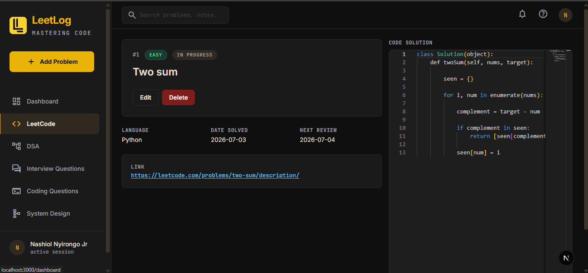
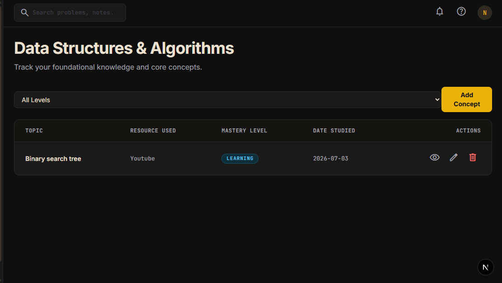
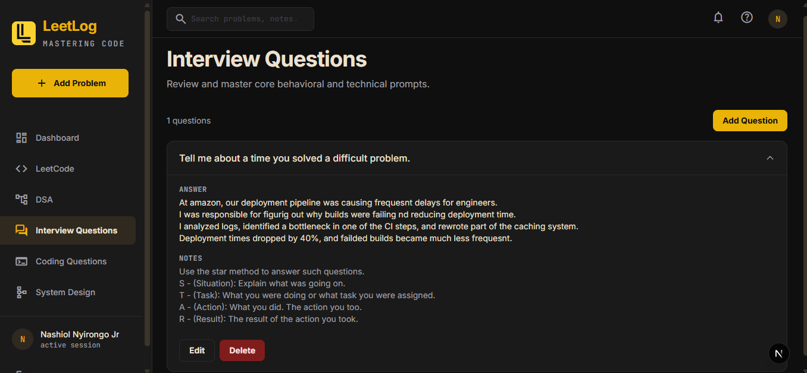
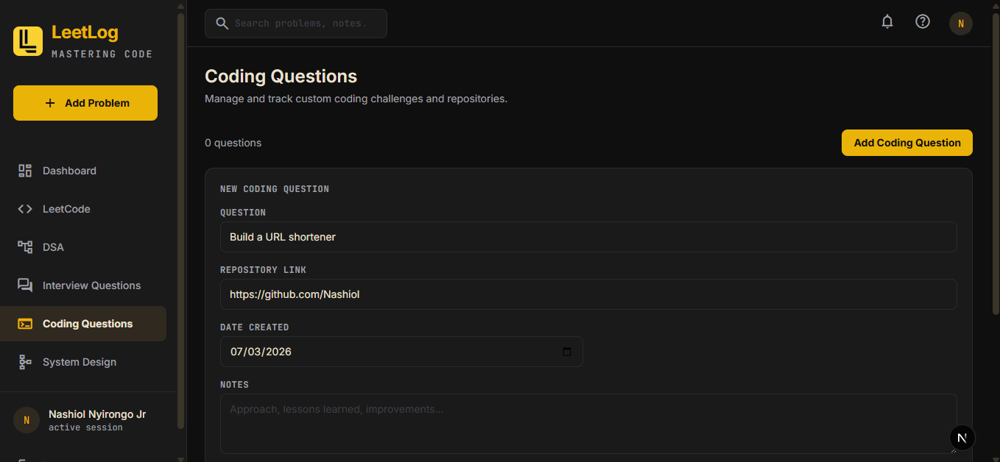
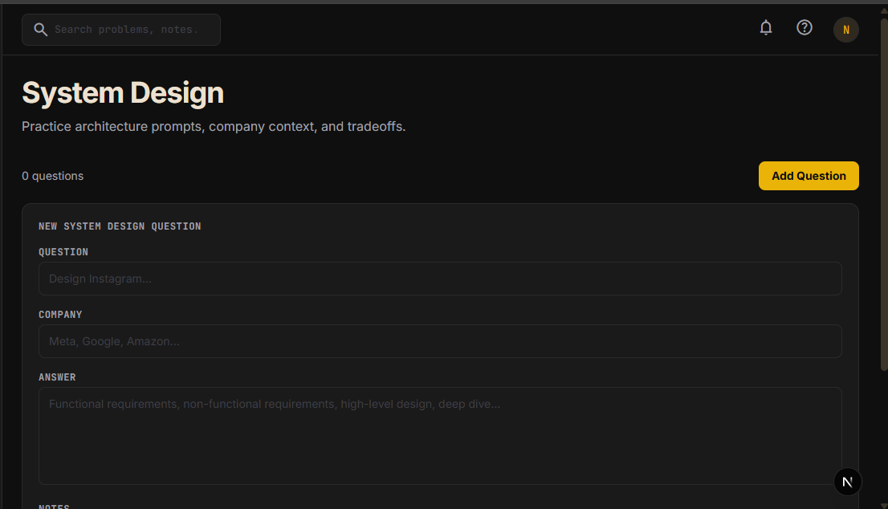

# LeetLog

> Track your LeetCode problem-solving journey — log problems, difficulty, solutions, and monitor your progress over time.

LeetLog is a full-stack web application that helps developers track, review, and master coding interview preparation. It features five distinct tracking areas and a built-in Spaced Repetition System (SRS) powered by the SM-2 algorithm.



---

## Features

### 📊 Dashboard
The central hub showing your preparation status at a glance:
- **Due Today** — problems scheduled for review via the spaced repetition system
- **Problems Solved** — breakdown by difficulty (Easy / Medium / Hard)
- **Current Streak** — consecutive days with at least one activity entry
- **Mastery Progress** — mastered vs total problems
- **Recent Activity** — last 5 entries across all tables

### 💻 LeetCode Problems
Full CRUD for tracking solved LeetCode problems:
- Log problem number, title, link, difficulty, language, and solution code
- Monaco Editor with syntax highlighting for code snippets
- Status badges: In Progress / Due for Review / Mastered
- Filter by difficulty and search by name or number
- Spaced repetition review flow with confidence rating (Hard → Very Easy)

### 🧠 DSA Concepts
Track Data Structures & Algorithms study sessions:
- Log topics (Binary Search, Dynamic Programming, Graphs, etc.)
- Track resources used (YouTube, NeetCode, textbooks, etc.)
- Mastery level progression: Not Started → Learning → Comfortable → Mastered
- View full notes in a popup modal



### ❓ Interview Questions
Build a reference library of behavioral and technical Q&A:
- Expandable accordion cards — click to reveal the full answer
- STAR method ready for behavioral responses



### 💾 Coding Questions
Track open-ended coding challenges with linked repository solutions:
- GitHub repo links open in a new tab
- Notes for approach, lessons learned, and improvements



### 🏗️ System Design
Organise system design questions tagged by company:
- Tag questions with the company that asked them (Meta, Google, Amazon, etc.)
- Expandable cards with structured answers
- Track functional requirements, non-functional requirements, deep dives



---

## Spaced Repetition System (SM-2)

LeetLog uses the SM-2 algorithm to optimise review scheduling. When you review a problem, you rate your confidence:

| Rating | Next Review | Ease Factor Change |
|---|---|---|
| 😰 Hard | +1 day | -0.2 (min 1.3) |
| 😐 Medium | +3 days | No change |
| 😊 Easy | +7 days | +0.1 |
| 🚀 Very Easy | +14 days | +0.15 |

After 4 successful reviews with Easy/Very Easy ratings, the problem is marked as **Mastered** and removed from the review queue.

---

## Tech Stack

| Layer | Technology |
|---|---|
| Framework | Next.js 16 (App Router) |
| Language | TypeScript |
| Database | Supabase (PostgreSQL) |
| Authentication | Supabase Auth (email + password) |
| Styling | Tailwind CSS v4 |
| Code Editor | Monaco Editor |
| Icons | Material Symbols |
| Fonts | Inter (UI), JetBrains Mono (code) |
| Deployment | Vercel |

---

## Getting Started

### Prerequisites
- Node.js 18+
- A Supabase project (free tier works)

### Environment Variables

Create a `.env.local` file in the project root:

```env
NEXT_PUBLIC_SUPABASE_URL=your_supabase_project_url
NEXT_PUBLIC_SUPABASE_ANON_KEY=your_supabase_anon_key
```

### Database Setup

Run the following SQL in your Supabase SQL editor to create the required tables:

```sql
CREATE TABLE leetcode_problems (
  id UUID DEFAULT gen_random_uuid() PRIMARY KEY,
  user_id UUID REFERENCES auth.users(id) NOT NULL,
  problem_number INTEGER NOT NULL,
  question TEXT NOT NULL,
  link TEXT NOT NULL,
  difficulty TEXT NOT NULL CHECK (difficulty IN ('easy', 'medium', 'hard')),
  programming_language TEXT NOT NULL,
  code_snippet TEXT DEFAULT '',
  notes TEXT DEFAULT '',
  date_solved DATE NOT NULL,
  next_review_date DATE NOT NULL,
  repetition_count INTEGER DEFAULT 0,
  ease_factor FLOAT DEFAULT 2.5,
  status TEXT DEFAULT 'in_progress' CHECK (status IN ('in_progress', 'due_for_review', 'mastered')),
  created_at TIMESTAMP DEFAULT now()
);

CREATE TABLE dsa_concepts (
  id UUID DEFAULT gen_random_uuid() PRIMARY KEY,
  user_id UUID REFERENCES auth.users(id) NOT NULL,
  topic TEXT NOT NULL,
  resource_used TEXT DEFAULT '',
  notes TEXT DEFAULT '',
  mastery_level TEXT DEFAULT 'not_started' CHECK (mastery_level IN ('not_started', 'learning', 'comfortable', 'mastered')),
  date_studied DATE NOT NULL,
  created_at TIMESTAMP DEFAULT now()
);

CREATE TABLE interview_questions (
  id UUID DEFAULT gen_random_uuid() PRIMARY KEY,
  user_id UUID REFERENCES auth.users(id) NOT NULL,
  question TEXT NOT NULL,
  answer TEXT DEFAULT '',
  notes TEXT DEFAULT '',
  created_at TIMESTAMP DEFAULT now()
);

CREATE TABLE coding_questions (
  id UUID DEFAULT gen_random_uuid() PRIMARY KEY,
  user_id UUID REFERENCES auth.users(id) NOT NULL,
  question TEXT NOT NULL,
  repository_link TEXT DEFAULT '',
  notes TEXT DEFAULT '',
  date_created DATE NOT NULL,
  created_at TIMESTAMP DEFAULT now()
);

CREATE TABLE system_design (
  id UUID DEFAULT gen_random_uuid() PRIMARY KEY,
  user_id UUID REFERENCES auth.users(id) NOT NULL,
  question TEXT NOT NULL,
  company TEXT DEFAULT '',
  answer TEXT DEFAULT '',
  notes TEXT DEFAULT '',
  created_at TIMESTAMP DEFAULT now()
);

-- Enable Row Level Security on all tables
ALTER TABLE leetcode_problems ENABLE ROW LEVEL SECURITY;
ALTER TABLE dsa_concepts ENABLE ROW LEVEL SECURITY;
ALTER TABLE interview_questions ENABLE ROW LEVEL SECURITY;
ALTER TABLE coding_questions ENABLE ROW LEVEL SECURITY;
ALTER TABLE system_design ENABLE ROW LEVEL SECURITY;

-- Create RLS policies (users can only access their own data)
CREATE POLICY "Users can manage their own leetcode problems"
  ON leetcode_problems FOR ALL
  USING (auth.uid() = user_id);

CREATE POLICY "Users can manage their own dsa concepts"
  ON dsa_concepts FOR ALL
  USING (auth.uid() = user_id);

CREATE POLICY "Users can manage their own interview questions"
  ON interview_questions FOR ALL
  USING (auth.uid() = user_id);

CREATE POLICY "Users can manage their own coding questions"
  ON coding_questions FOR ALL
  USING (auth.uid() = user_id);

CREATE POLICY "Users can manage their own system design entries"
  ON system_design FOR ALL
  USING (auth.uid() = user_id);
```

### Install & Run

```bash
npm install
npm run dev
```

Open [http://localhost:3000](http://localhost:3000) and sign up to get started.

---

## Project Structure

```
leetlog/
├── app/
│   ├── (auth)/           # Login & signup pages
│   ├── (dashboard)/      # Protected dashboard pages
│   │   ├── dashboard/    # Main dashboard
│   │   ├── leetcode/     # LeetCode problem tracking
│   │   ├── dsa/          # DSA concepts
│   │   ├── interview/    # Interview questions
│   │   ├── coding/       # Coding questions
│   │   └── system-design/# System design
│   └── api/              # REST API routes
├── components/
│   ├── ui/               # Reusable primitives (Button, Badge, MonacoEditor)
│   ├── leetcode/         # LeetCode-specific components
│   ├── dsa/              # DSA-specific components
│   ├── coding/           # Coding-specific components
│   ├── interview/        # Interview-specific components
│   ├── system-design/    # System design components
│   ├── dashboard/        # Dashboard widgets
│   └── shared/           # Sidebar, header, search, notifications
├── lib/
│   ├── supabase.ts       # Supabase client (browser)
│   ├── supabase-server.ts# Supabase client (server)
│   ├── sm2.ts            # SM-2 spaced repetition algorithm
│   └── utils.ts          # Utility functions
└── types/
    └── index.ts          # TypeScript interfaces
```

---

## Deployment

LeetLog is designed for deployment on Vercel:

1. Push your repository to GitHub
2. Import the project in Vercel
3. Add the environment variables (`NEXT_PUBLIC_SUPABASE_URL`, `NEXT_PUBLIC_SUPABASE_ANON_KEY`)
4. Deploy

---

## License

MIT
