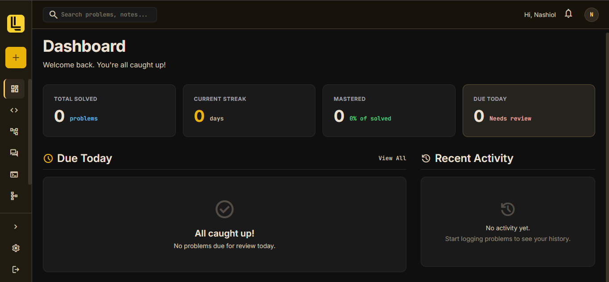
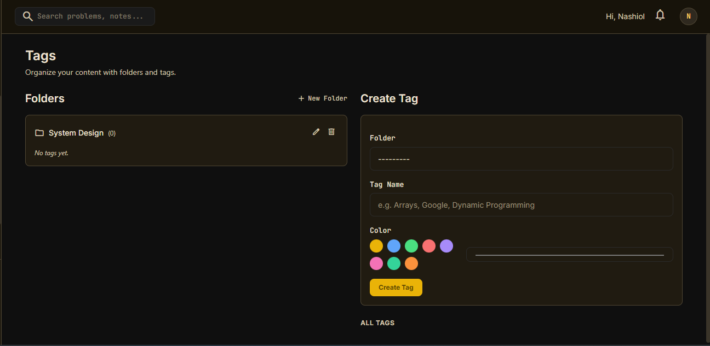

# LeetLog

> Track your LeetCode problem-solving journey — log problems, difficulty, solutions, and monitor your progress over time.

LeetLog is a full-stack web application that helps developers track, review, and master coding interview preparation. It features five distinct tracking areas and a built-in Spaced Repetition System (SRS) powered by the SM-2 algorithm.




## Features

- **LeetCode Tracker** — Log problems with difficulty, language, solution links, and personal notes
- **Spaced Repetition (SM-2)** — Automatic review scheduling with confidence ratings (Hard / Medium / Easy / Very Easy)
- **DSA Study Log** — Track Data Structures & Algorithms study sessions with mastery levels
- **Interview Questions** — Common behavioral and technical Q&A reference
- **Coding Challenges** — Open-ended coding problems with linked GitHub repositories
- **System Design** — System design questions tagged by company
- **Job Application Tracker** — Track job applications with status, salary, and deadlines
- **Tags** — Organize entries across all sections with color-coded tags and folders
- **Dashboard** — Due today reviews, streak tracking, difficulty breakdown, mastery progress, and recent activity
- **Search** — Full-text search across all sections
- **Rich Text Notes** — Quill.js editor for formatted notes across all forms
- **Dark Theme** — HUD-inspired dark UI with yellow accent

## Tech Stack

| Layer | Technology |
|---|---|
| Backend | Django 6.0 |
| Database | PostgreSQL (Supabase) or SQLite |
| Styling | Tailwind CSS (CDN) |
| Rich Text | Quill.js 1.3.7 |
| Icons | Material Symbols |
| Fonts | Inter + JetBrains Mono |
| WSGI Server | Gunicorn |
| Static Files | WhiteNoise |

## Self-Hosting with Docker

### Prerequisites

- [Docker](https://docs.docker.com/get-docker/) and [Docker Compose](https://docs.docker.com/compose/install/)
- A PostgreSQL database (e.g. [Supabase](https://supabase.com), [Neon](https://neon.tech), or a self-hosted Postgres instance)

### 1. Clone the repository

```bash
git clone https://github.com/your-username/leetlog.git
cd leetlog
```

### 2. Create your environment file

```bash
cp .env.sample .env
```

Edit `.env` and fill in your values:

```env
SECRET_KEY=your-random-secret-key
DEBUG=False
ALLOWED_HOSTS=localhost,127.0.0.1,your-domain.com

SUPABASE_DB_NAME=your-db-name
SUPABASE_DB_USER=your-db-user
SUPABASE_DB_PASSWORD=your-db-password
SUPABASE_DB_HOST=your-db-host
SUPABASE_DB_PORT=5432
```

### 3. Build and run

```bash
docker compose up -d
```

The app will be available at **http://localhost:8000**.

### 4. Create a superuser (optional)

```bash
docker compose exec app python manage.py createsuperuser
```

### Common Docker commands

```bash
docker compose up -d          # Start in background
docker compose down            # Stop
docker compose logs -f         # Tail logs
docker compose exec app python manage.py shell   # Django shell
```

## Local Development (without Docker)

### Prerequisites

- Python 3.12+
- PostgreSQL (or use SQLite — see below)

### 1. Clone and set up

```bash
git clone https://github.com/your-username/leetlog.git
cd leetlog
python -m venv venv
source venv/bin/activate   # Windows: venv\Scripts\activate
pip install -r requirements.txt
```

### 2. Configure database

**Option A: PostgreSQL (default)**

Create a `.env` file with your database credentials (see `.env.sample`).

**Option B: SQLite**

Open `leetlog/settings.py` and swap the database config — comment out the PostgreSQL block and uncomment the SQLite block:

```python
# DATABASES = {
#     "default": {
#         "ENGINE": "django.db.backends.postgresql",
#         ...
#     }
# }

DATABASES = {
    'default': {
        'ENGINE': 'django.db.backends.sqlite3',
        'NAME': BASE_DIR / 'db.sqlite3',
    }
}
```

### 3. Run migrations and start

```bash
python manage.py migrate
python manage.py createsuperuser
python manage.py runserver
```

The app will be available at **http://localhost:8000**.

## Project Structure

```
leetlog/
├── manage.py
├── Dockerfile
├── docker-compose.yml
├── .env.sample
├── requirements.txt
├── leetlog/                  # Django project settings
├── users/                    # Custom User model + auth
├── dashboard/                # Dashboard + search + settings
├── leetcode/                 # LeetCode tracker + SM-2 SRS
├── dsa/                      # DSA study sessions
├── jobs/                     # Job application tracker
├── tags/                     # Tagging system
├── interview_questions/      # Interview Q&A
├── coding_questions/         # Coding challenges
├── system_design/            # System design Q&A
├── components/               # Shared template partials
├── templates/                # Base layout, navbar, sidebar
└── static/                   # CSS, images
```

## Roadmap (V2)

- Mobile app (PWA)
- LeetCode API integration (auto-fill problem details)
- Shareable profiles
- AI hint system
- Interview simulator / timed mock mode
- Email reminders for due reviews
- Team / study group mode

## Author

**Nashiol** — July 2026
